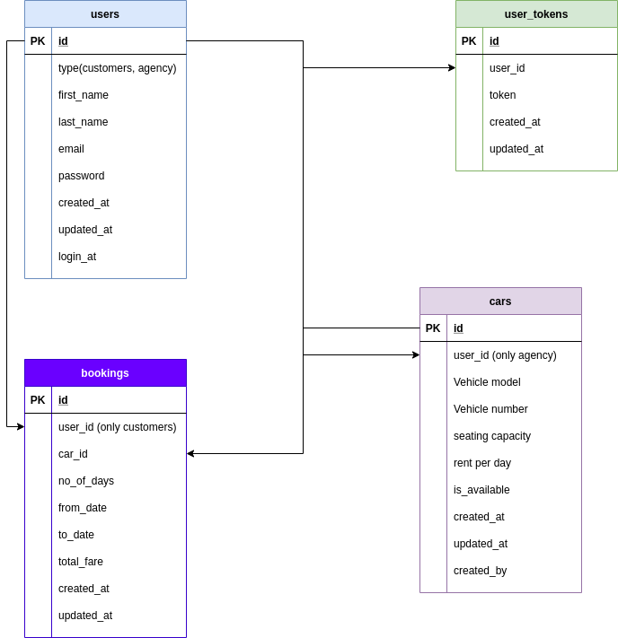

# OBJECTIVE
The objective of this website is to make a website for agencies from where people can book a vehicle for rent. I have successfully completed it. I made both admin and customer panels. Made different authentication for both admin and customers. Admin will add the cars and then it will reflect back to the main website. Then customers can book it as well. Also customers can book the cars if they are logged in. Also Admin are not allowed to book the car even if they are logged-in. In customer side, I am just showing the available cars list. After booking they can see the ongoing booking status. Also customers can see the booking histories. 

# TECHNOLOGIES USED
* Frontend: vue JS, vuX, vuetify, HTML, CSS, Bootstrap
* Backend: PHP, Laravel, API
* Database: mySQL

# DATABASE DESIGN

# GIF VIEW

